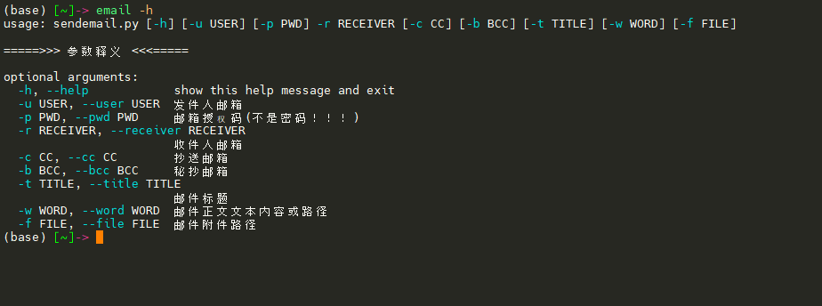

# email
在终端中使用命令行直接发送邮件，支持抄送和秘抄，支持附件压缩

## 用法示例



## 前期准备
* 邮箱相关
  * 个人邮箱，邮箱授权码，邮箱smtp服务器地址，邮箱smtp服务器port口
  * 脚本支持邮箱域名如下
    ```python
      gmail.com	yahoo.com	outlook.com     hotmail.com     aol.com     gmx.com     zoho.com
      icloud.com	mail.com	protonmail.com	qq.com	        163.com	    126.com

* 脚本环境
  * python3
  * requiements:
    ```python
      argparse
      os
      smtplib
      sys
      time
      zipfile
      email

## 参数说明
```python
  -u  发件人邮箱
  -p  邮箱授权码，注意不是邮箱密码！！！
  -r  收件人邮箱组，多个收件人用''写成一个字符串， ','为分隔符
  -b  抄送邮箱组
  -c  秘抄邮箱组
  -t  邮件标题
  -w  邮件正文，或编辑好的文本文件路径
  -f  附件文件路径，文件会被压缩后当作邮件附件发送

## 用法
* 设置默认邮箱
  ```python
      # 脚本第50行，定义用户的默认邮箱，这样就不用每次填用户名密码
      def cmd_line():
      default_account = {
          'user': '1*******22@qq.com',
          'pwd': 'wt*******bdca'
      }

* 用法示例
  > email -r xi*****@126.com -w 我遇见你，是最美丽的意外 -f ~/test.py -t 这是我的第一个脚本
  
